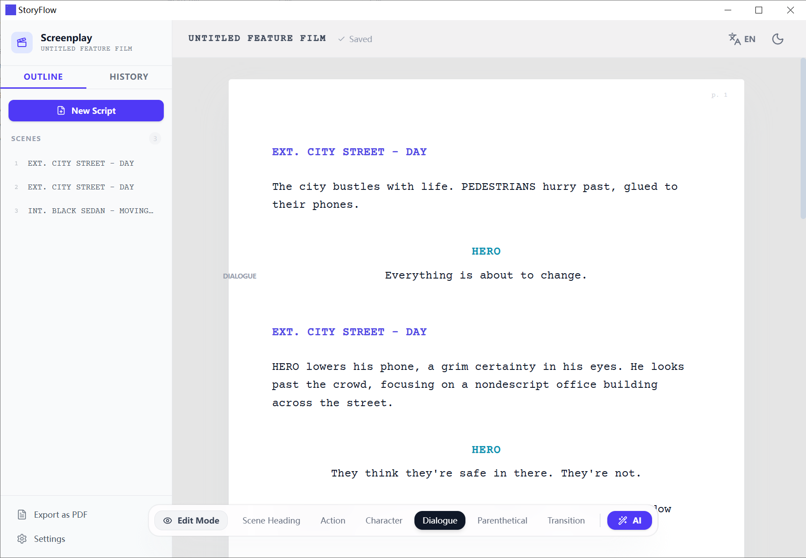
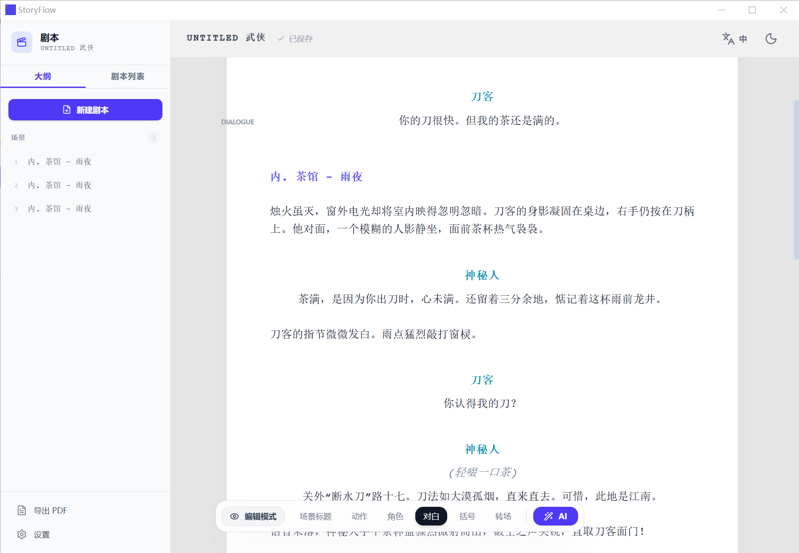

<div align="center">
  <h1>StoryFlow</h1>
  <p>AI-Powered Screenplay & Script Editor</p>
</div>

An intelligent screenplay editor supporting multiple script formats with AI assistance via Gemini or DeepSeek APIs.

## Features

- **Multiple Script Formats**
  - Standard Hollywood format
  - Sitcom, stage play, commercial
  - Short video formats
  - Chinese genres: danmei, xuanhuan, wuxia, and more

- **AI Assistance**
  - Continue writing from any point
  - Generate creative ideas
  - Rewrite existing blocks
  - Support for Gemini & DeepSeek providers

- **Bilingual Support**
  - English and Chinese interfaces
  - Dual-language script mode

- **Professional Formatting**
  - Proper pagination for print (US Letter / A4)
  - Smart block type detection
  - Standard screenplay margins and spacing

## Screenshots

### English Interface


### Chinese Interface


## Prerequisites

- Node.js 18+

## Installation

```bash
# Clone the repository
git clone <repository-url>
cd StoryFlow

# Install dependencies
npm install
```

## Configuration

Create a `.env.local` file in the project root:

```bash
# Gemini API (default)
GEMINI_API_KEY=your_gemini_api_key_here

# Or use DeepSeek
DEEPSEEK_API_KEY=your_deepseek_api_key_here
```

You can also configure API keys through the app settings UI.

## Usage

```bash
# Start development server
npm run dev

# Build for production
npm run build

# Preview production build
npm run preview
```

Open [http://localhost:5173](http://localhost:5173) to start writing.

## Keyboard Shortcuts

| Shortcut | Action |
|----------|--------|
| `Tab` / `Shift+Tab` | Cycle block types |
| `Enter` | Create new block |
| `Backspace` (at start) | Merge with previous block |
| `Ctrl/Meta + Arrow keys` | Navigate between blocks |

AI shortcuts are customizable in settings.

## Project Structure

```
StoryFlow/
├── App.tsx                  # Main application with state management
├── types.ts                 # TypeScript definitions
├── constants.ts             # Templates, translations, prompts
├── components/
│   ├── EditorBlock.tsx      # Individual script block editor
│   ├── Sidebar.tsx          # Script list & navigation
│   ├── Toolbar.tsx          # Block type selector
│   └── SettingsModal.tsx    # Settings UI
├── services/
│   └── geminiService.ts     # AI API integration
└── utils/
    └── pagination.ts        # Page break calculation
```

## Script Storage

Scripts are stored locally in your browser using localStorage:
- `script_index`: List of all scripts
- `script_{id}`: Full screenplay data

## License

MIT

---

Built with React + TypeScript + Vite
